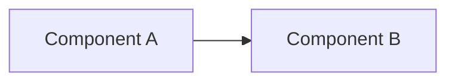

# [Topic Title]

[Brief 1-2 sentence executive summary of what this document covers and which packages/subsystems it touches.]

---

## 1. Overview & Architectural Role

[Explain the high-level concept, why it exists, and how it interacts with the rest of Colonist Gambit.]



---

## 2. Core Concepts & Data Structures

[Detail the data structures, types, interfaces, or mathematical definitions.]

```typescript
export interface ExampleType {
  readonly id: string;
}
```

---

## 3. Detailed Logic & Algorithms

[Step-by-step technical explanation, state transitions, validation checks, or mathematical formulas.]

$$x = \text{formula}$$

---

## 4. Integration Points & Related Files

- **Source Code**: [`packages/...`](../../packages/...)
- **Related Docs**: [Related Document](./architecture.md)
- **Tests**: [`packages/.../tests/...`](../../packages/...)
