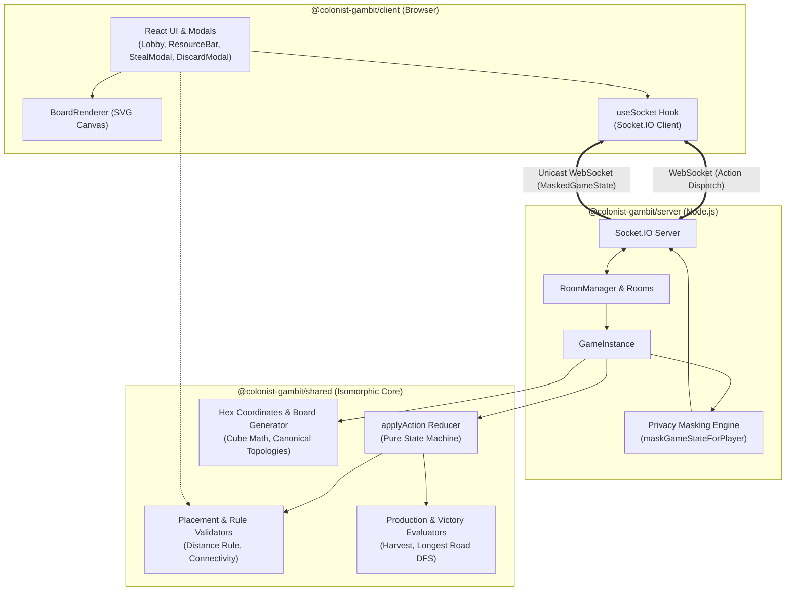
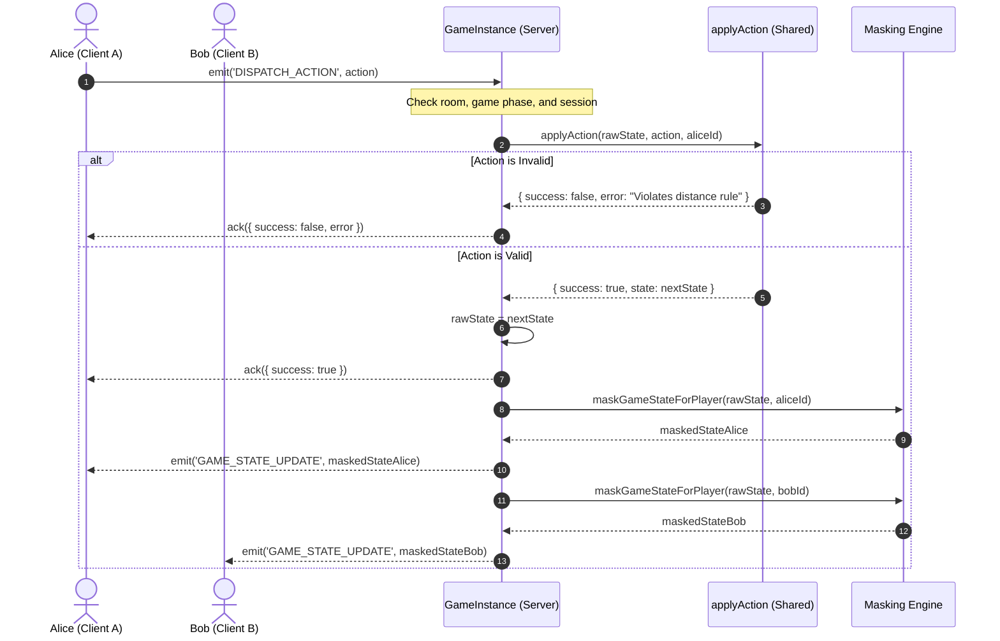

# System Architecture

This document describes the high-level system architecture, distributed state management, and design philosophy of **Colonist Gambit**.

---

## High-Level Topology

Colonist Gambit uses an **Authoritative Server** architecture with an isomorphic **Pure Domain Core**:



---

## Monorepo Package Boundaries

The repository is divided into three strictly decoupled packages using npm workspaces:

### 1. `@colonist-gambit/shared`
- **Zero external dependencies**: Contains only pure TypeScript and standard library utilities.
- **Isomorphic execution**: Runs unchanged in Node.js, modern browsers, web workers, and edge environments.
- **Scope**:
  - Domain types: `GameState`, `MaskedGameState`, `GameAction`, `CatanBoard`, `Player`, `ResourceCount`.
  - Hex mathematics and canonical graph algorithms.
  - Pure state transition reducer: `applyAction`.
  - Board generators and canonical layout constants.
  - Placement rule validators (used both by the server for authoritative validation and by the client for legal move highlighting).

### 2. `@colonist-gambit/server`
- **Dependencies**: Node.js, Express, Socket.IO, `@colonist-gambit/shared`.
- **Authoritative Host**: Owns the master `GameState`, executes actions through the shared reducer, and maintains room/socket sessions.
- **State privacy guarantee**: Runs `maskGameStateForPlayer` before transmitting game state to any socket, preventing clients from snooping on opponents' resources, unplayed dev cards, or deck order.

### 3. `@colonist-gambit/client`
- **Dependencies**: React, Vite, Socket.IO Client, `@colonist-gambit/shared`.
- **Reactive presentation**: Renders `MaskedGameState` received from the server.
- **Zero server trust**: Client inputs are treated as untrusted *action intents* (`GameAction`) rather than state mutations. The client never mutates game state directly.

---

## The Pure Functional Reducer Pattern

At the core of Colonist Gambit is a pure reducer function:

```typescript
function applyAction(
  prevState: GameState,
  action: GameAction,
  actingPlayerId: PlayerId,
  rng: () => number = Math.random
): ActionResult;

type ActionResult =
  | { success: true; state: GameState }
  | { success: false; error: string };
```

### Key Properties

1. **Immutability**:
   `applyAction` creates a deep clone of `prevState` before executing state transitions. If an action fails validation at any point, the original state remains intact, and an explicit error string is returned.
2. **Determinism & Testability**:
   Randomness (dice rolls, resource stealing, deck shuffling) is injected via an optional `rng` function parameter (`() => number`). In test suites, deterministic pseudorandom number generators or mock sequences are passed to assert deterministic outcomes.
3. **Optimistic Execution Potential**:
   Because `applyAction` is located in `@colonist-gambit/shared`, the client can optionally execute an action optimistically to render UI transitions instantly while awaiting the server's authoritative broadcast.

---

## Authoritative Server Execution Loop

Every state change follows a strict unidirectional sequence:



---

## State Privacy: Fog-of-War Projection

In competitive board games like Catan, players must not have access to opponent hands or the order of cards in the deck. In Colonist Gambit, privacy is enforced mathematically via a projection function $\Pi_{\text{viewerId}}$:

$$\Pi_{\text{viewerId}}: \text{GameState} \longrightarrow \text{MaskedGameState}$$

### Transformation Details

| Field | In Master `GameState` | In `MaskedGameState` (Viewer: Alice) |
|---|---|---|
| Alice's Resources | Full `ResourceCount` (`{ lumber, brick, ... }`) | Full `ResourceCount` (`me.resources`) |
| Bob's Resources | Full `ResourceCount` (`{ lumber, brick, ... }`) | Scalar total only: `resourceCardCount` ($\sum \text{cards}$) |
| Alice's Dev Cards | Array of `{ type, turnPurchased }` | Full array (`me.devCards.unplayed`) |
| Bob's Dev Cards | Array of `{ type, turnPurchased }` | Count only: `devCardCount` ($|\text{unplayed}|$) |
| Dev Card Deck | Array of 25 cards in shuffled order | Count only: `devCardDeckRemaining` ($|\text{deck}|$) |
| Board & Buildings | Complete public graph (`hexes`, `vertices`, `edges`) | Complete public graph (Identical) |
| Public Victory Points | Computed per player | Computed per player |
| Hidden VP Cards | Included in `player.devCards.unplayed` | Only Alice's own hidden VP cards are inspectable |

This approach ensures that even if a malicious client inspects memory or WebSocket frames in browser DevTools, hidden information cannot be extracted because the server never serializes it to untrusted recipients.
