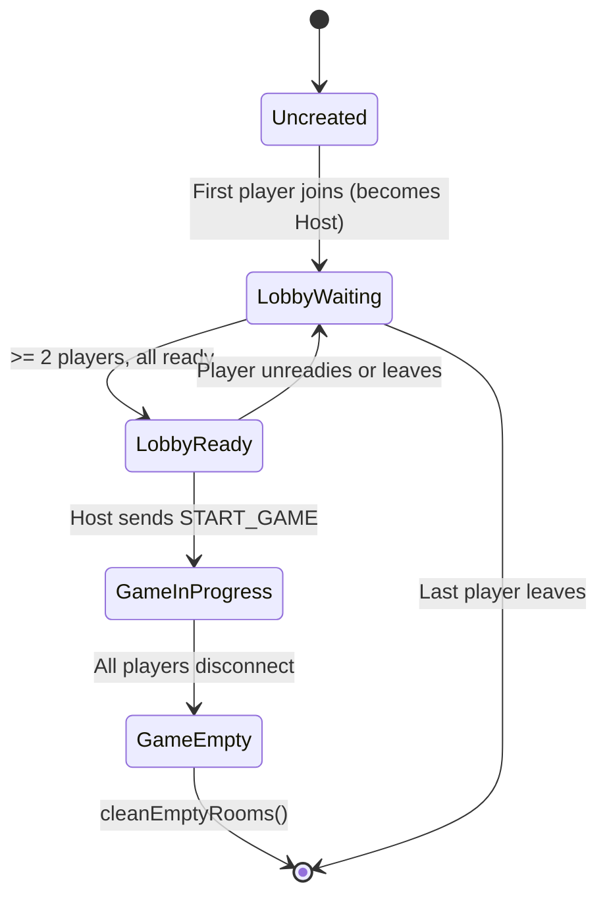

# Networking & Multiplayer Protocol

This document specifies the real-time networking protocol, Socket.IO event schemas, room lifecycle states, reconnection mechanics, and state projection pipelines used by **Colonist Gambit**.

---

## 1. Network Topology & Transport

Colonist Gambit uses [Socket.IO](https://socket.io/) over WebSocket transport (with HTTP long-polling fallback) for full-duplex communication between the browser client and Node.js server.

```
┌──────────────────┐               WebSocket               ┌──────────────────┐
│  React Client A  │ ◄───────────────────────────────────► │                  │
└──────────────────┘                                       │                  │
                                                           │  Express +       │
┌──────────────────┐               WebSocket               │  Socket.IO       │
│  React Client B  │ ◄───────────────────────────────────► │  Server          │
└──────────────────┘                                       │  (Port 4000)     │
                                                           │                  │
┌──────────────────┐               WebSocket               │                  │
│  React Client C  │ ◄───────────────────────────────────► │                  │
└──────────────────┘                                       └──────────────────┘
```

- **Default Server Port**: 4000 (`http://localhost:4000`)
- **CORS Policy**: Configured to accept connections from any local origin (`*`) with `GET` and `POST` methods.
- **Health Check**: `GET /health` returns `{ status: "ok", timestamp: number }`.

---

## 2. Socket.IO Event Contracts

### Client $\to$ Server Events

#### 1. `JOIN_ROOM`
Request to join an existing room or create a new room with a specified ID.
- **Payload**:
  ```typescript
  {
    roomId: string;
    playerId: string;
    name: string;
    color: 'red' | 'blue' | 'orange' | 'white' | 'green' | 'brown';
  }
  ```
- **Acknowledgement Callback**:
  ```typescript
  (response: { success: boolean; error?: string }) => void
  ```
- **Validation**:
  - Rejects if room is full ($\ge 4$ players).
  - Rejects if color is already claimed by an active player in the room.
  - Rejects if the game is already in progress (unless reconnecting with the same `playerId`).

#### 2. `LEAVE_ROOM`
Explicit request to exit the current room.
- **Payload**: None
- **Acknowledgement Callback**: `(response: { success: boolean }) => void`

#### 3. `SET_READY`
Toggles readiness in the pre-game lobby.
- **Payload**:
  ```typescript
  {
    isReady: boolean;
  }
  ```

#### 4. `START_GAME`
Dispatched by the room host to start the game match.
- **Payload**: None
- **Acknowledgement Callback**: `(response: { success: boolean; error?: string }) => void`
- **Validation**:
  - Caller must be designated host (`player.isHost === true`).
  - Room must have between 2 and 4 players.
  - All non-host players must be marked `isReady === true`.

#### 5. `DISPATCH_ACTION`
Dispatches an in-game action intent to the authoritative reducer.
- **Payload**: `GameAction` (e.g. `ROLL_DICE`, `BUILD_ROAD`, `DISCARD_CARDS`)
- **Acknowledgement Callback**: `(response: { success: boolean; error?: string }) => void`
- **Execution**: Routed directly to `gameInstance.dispatchAction(action, playerId)`.

---

### Server $\to$ Client Events

#### 1. `LOBBY_STATE_UPDATE`
Broadcast to all sockets in a room whenever player composition or ready status changes.
- **Payload**:
  ```typescript
  export interface LobbyState {
    roomId: string;
    players: {
      id: string;
      name: string;
      color: PlayerColor;
      isHost: boolean;
      isReady: boolean;
    }[];
    canStart: boolean;
  }
  ```

#### 2. `GAME_STARTED`
Broadcast to all sockets in a room when the host triggers `START_GAME`.
- **Payload**: None (Signals clients to mount the board view).

#### 3. `GAME_STATE_UPDATE`
Unicast to each connected player individually containing their personalized view.
- **Payload**: `MaskedGameState` (Privacy-redacted domain state).

---

## 3. Room Lifecycle & Host Migration

Room state is managed by `RoomManager` and `Room` in `packages/server/src/rooms/RoomManager.ts`:



### Host Delegation Rules
1. The first player to join a new room is automatically designated as **Host** (`isHost = true`, `isReady = true`).
2. If the current host leaves the room or disconnects during the lobby phase:
   - Host status transfers automatically to the next available player in the room map.
   - The newly promoted player is marked ready.

---

## 4. Disconnect & Reconnection Protocol

Network disconnections must not corrupt or terminate ongoing matches. Colonist Gambit handles connection interruptions gracefully:

### Disconnection Sequence
1. Socket emits `'disconnect'` on the server.
2. In `GameInstance.handleDisconnect(socketId)`:
   - The corresponding player record is located in `sessions`.
   - The player's state is updated: `state.players[playerId].connected = false`.
3. If at least one active player remains connected:
   - The room stays active.
   - Other players receive an updated `MaskedGameState` showing the opponent's `connected: false` flag.
4. If **all** players disconnect, the room is safely garbage-collected via `cleanEmptyRooms()`.

### Reconnection Sequence
1. A dropped client reconnects and issues `JOIN_ROOM` with their original `playerId`:
   ```typescript
   if (room.game) {
     const reconnected = room.game.handleReconnect(data.playerId, socket.id);
     if (reconnected) {
       socket.join(data.roomId);
       broadcastGameState(data.roomId);
       return;
     }
   }
   ```
2. The server updates the session's `socketId`, marks `state.players[playerId].connected = true`, and unicasts an immediate state update.
3. The client receives their `MaskedGameState` and seamlessly restores board rendering without state desynchronization.

---

## 5. Unicast Projection: `maskGameStateForPlayer`

The server never broadcasts raw `GameState` to rooms with `io.to(roomId).emit(...)`. Instead, it uses a per-player unicast loop:

```typescript
const broadcastGameState = (roomId: string) => {
  const room = roomManager.getRoom(roomId);
  if (!room || !room.game) return;

  for (const player of room.players.values()) {
    const maskedState = room.game.getMaskedState(player.id);
    io.to(player.socketId).emit('GAME_STATE_UPDATE', maskedState);
  }
};
```

### Field Redaction Implementation

```typescript
export function maskGameStateForPlayer(state: GameState, viewerId: PlayerId): MaskedGameState {
  const me = state.players[viewerId]!;
  const opponents: MaskedPlayer[] = [];

  for (const [pId, player] of Object.entries(state.players)) {
    if (pId === viewerId) continue;

    // Redact resource cards into a single integer count
    const resourceCardCount =
      player.resources.lumber +
      player.resources.brick +
      player.resources.wool +
      player.resources.grain +
      player.resources.ore;

    opponents.push({
      id: player.id,
      name: player.name,
      color: player.color,
      resourceCardCount,
      devCardCount: player.devCards.unplayed.length, // Hand dev cards redacted
      playedDevCards: [...player.devCards.played],    // Played cards are public
      availablePieces: { ...player.availablePieces },
      stats: { ...player.stats },
      connected: player.connected,
    });
  }

  return {
    ...publicStateFields,
    me,                                              // Full private inventory
    opponents,                                       // Redacted views
    bankResourceCount: state.bank,
    devCardDeckRemaining: state.devCardDeck.length,  // Deck order redacted
  };
}
```
